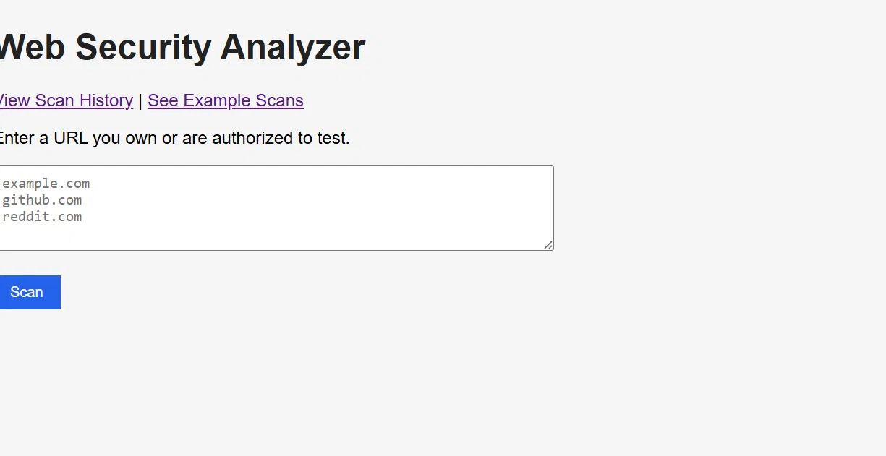
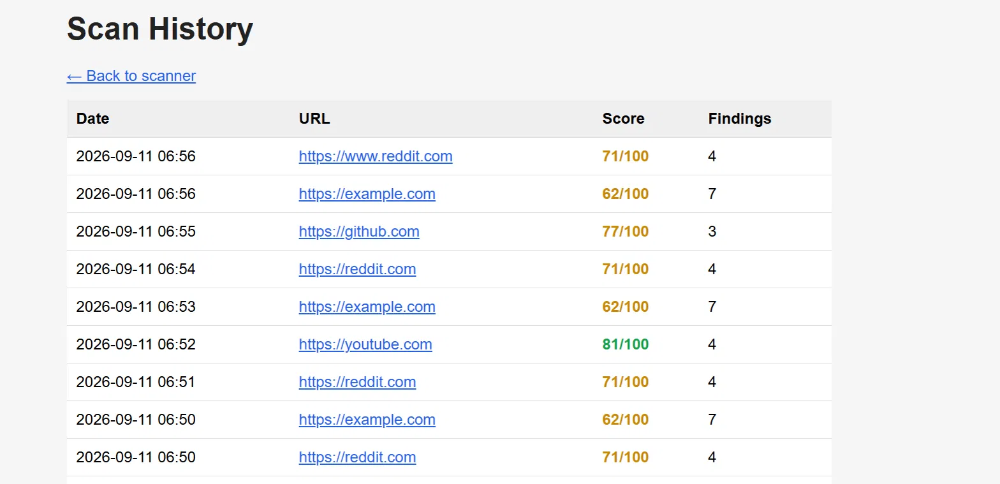
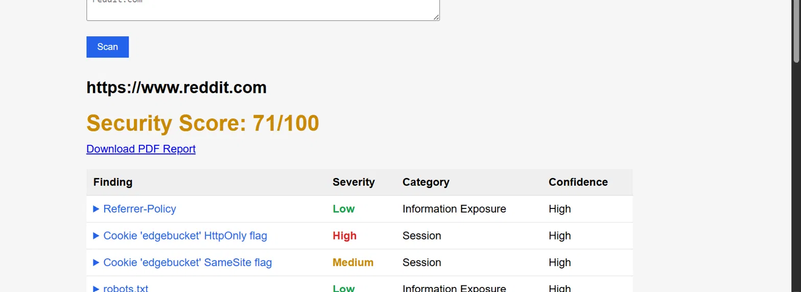
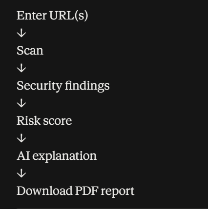
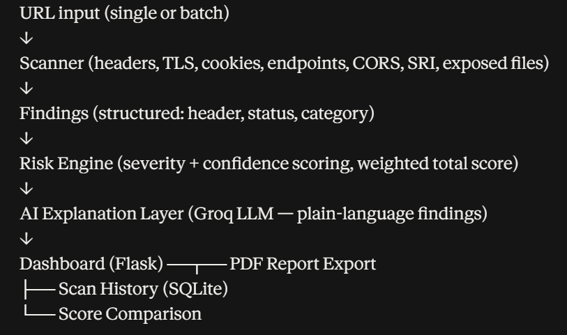

# Web Security Analyzer

> ⚠️ **Only scan systems you own or have explicit written authorization to test.** This tool performs passive checks only, but running any scanner against a system without permission may violate computer misuse laws in your jurisdiction.

An AI-assisted web security analysis and reporting tool. **This is not a pentesting tool or an automated hacker** — it performs a focused set of safe, passive checks against a URL you own or are authorized to test, then uses an AI layer to explain each finding in plain language, the way a security analyst would explain it to a developer.

## Demo




**What it does:** scans a website for 8 categories of common security misconfigurations, scores it out of 100, and explains every finding in plain English using AI — not just "Missing: X-Frame-Options."




**Quick start:**
```bash
git clone https://github.com/malaikamalik23/Web-Security-Analyzer
cd Web-Security-Analyzer
pip install -r requirements.txt
python ui/app.py
```
Then open `http://127.0.0.1:5000`. Full setup, including the free AI API key, is below.

## Security checks

| Category | Checks |
|---|---|
| **Headers** | Content-Security-Policy, Strict-Transport-Security, X-Frame-Options, X-Content-Type-Options, Referrer-Policy |
| **TLS / HTTPS** | HTTPS enabled, HTTP→HTTPS redirect, certificate issuer & expiry, certificate trust validation |
| **Cookies** | Secure, HttpOnly, and SameSite flags on every cookie set, including cookies set on redirects |
| **CORS** | Wildcard origins, wildcard-with-credentials, reflected-arbitrary-origin patterns |
| **Subresource Integrity** | External `<script>`/`<link>` tags missing an `integrity` attribute |
| **Exposed sensitive files** | `.git/config`, `.env`, common backup file patterns, database dumps |
| **Information exposure** | robots.txt contents, security.txt presence (RFC 9116) |
| **Connectivity** | Gracefully reports if a target is unreachable, instead of crashing or hanging |

Each finding carries a **severity** (High/Medium/Low), a **confidence** rating (how certain the check is — a missing header is a hard fact; a failed TLS handshake could mean an untrusted cert *or* just a network hiccup), and a **category**.

## Why this exists

Most security scanners either dump raw technical output with no context, or require deep security expertise to interpret. This tool bridges that gap:

> **Risk:** Medium
> **What does this mean?** The application may be more exposed to clickjacking attacks, since no anti-framing header is present.
> **Why does it matter?** An attacker may be able to embed the site inside another webpage and trick users into interacting with it.
> **Recommended action:** Configure an appropriate anti-framing policy, such as CSP frame-ancestors.
> **Category:** Session/Clickjacking

## What this tool does *not* do

Being upfront about this matters more than the feature list:

- It does **not** attempt to exploit anything — no SQL injection, XSS payloads, auth bypass attempts, or any active attack.
- It does **not** crawl a site or scan multiple pages — it checks the single URL provided (though it can scan several URLs in one batch).
- It does **not** guarantee completeness — a clean report means no *checked* issues were found, not that the site has no vulnerabilities.
- Severity ratings are static, rule-based estimates, not a substitute for professional risk assessment.
- The exposed-files check uses a heuristic (checking whether the response looks like HTML) to avoid false positives from sites that return a normal page instead of a 404 for unknown paths — this heuristic isn't perfect.

## Features

- **Security scoring** — a weighted 0–100 score: severity sets the base penalty, confidence scales it down when a check is less certain, and repeated findings in the same category see diminishing weight rather than compounding indefinitely.
- **Live AI explanations** — powered by Groq's free API (no credit card required), with a static-template fallback if the API is ever unavailable.
- **PDF report export** — a shareable, formatted report per scan.
- **Scan history** — every scan is saved locally (SQLite) and browsable later.
- **Score comparison** — each new scan shows how the score changed since the last scan of the same URL.
- **Batch scanning** — scan multiple URLs at once.
- **Example scans** — pre-run results for a few well-known sites, viewable without running a live scan.
- **Rate limiting** — a scan cooldown to prevent accidental rapid-fire scanning.

## Architecture




Each stage only receives structured data from the one before it — the AI layer, for example, is given a single finding's `{header, status, severity, category, confidence}`, never the raw site content. This keeps explanations grounded and auditable rather than the model reasoning over an entire scraped page.

## Tech stack

- **Python** — scanner, risk engine, AI layer
- **Flask** — dashboard
- **SQLite** — scan history
- **ReportLab** — PDF report generation
- **Groq API** (`openai/gpt-oss-120b`, via the OpenAI-compatible client) — free tier, no credit card required, powers the AI explanations
- **pytest** — automated tests, including integration tests run against a locally controlled Flask test target

## Full setup

```bash
git clone https://github.com/malaikamalik23/Web-Security-Analyzer
cd Web-Security-Analyzer
python -m venv venv
venv\Scripts\activate      # Windows
# source venv/bin/activate # macOS/Linux

pip install -r requirements.txt
```

Create a `.env` file in the project root:

GROQ_API_KEY=your_groq_api_key_here

Get a free key at [console.groq.com](https://console.groq.com) — no credit card required.

**Run the dashboard:**
```bash
python ui/app.py
```
Then open `http://127.0.0.1:5000`. Enter one or more URLs you own or are authorized to test (one per line for batch scanning), or visit `/examples` to see pre-run results without scanning anything yourself.

**Run from the command line instead:**
```bash
python main.py
```

## Testing

```bash
pytest tests/
```

Every scanner check is validated against a locally controlled Flask test target with known-good and known-bad configurations — not just live third-party sites. This includes:
- Deliberately missing vs. correctly-configured security headers
- Cookies with and without proper flags
- A self-signed TLS certificate (to confirm untrusted certs are correctly flagged with low confidence)
- Deliberately misconfigured vs. correctly-configured CORS
- Missing vs. properly-flagged Subresource Integrity
- Deliberately exposed `.git`/`.env` files

This ground-truth approach caught and fixed several real bugs during development — including a severity-scoring substring bug, a port-handling bug in the endpoint checker, and a false-positive bug in the exposed-files checker (caused by sites returning a normal page instead of a 404 for unknown paths). The test-target app lives in a separate sibling project and isn't included in this repo.

## Known limitations

- The AI layer depends on Groq's free-tier availability; if unavailable, the code falls back to static template explanations (toggle `USE_AI` in `ai_layer/explainer.py`).
- The exposed-sensitive-files check's HTML-detection heuristic can, in principle, still be fooled by an unusual server configuration.
- This is a learning/portfolio project, not a production security tool — see "What this tool does not do" above.

## License

MIT

